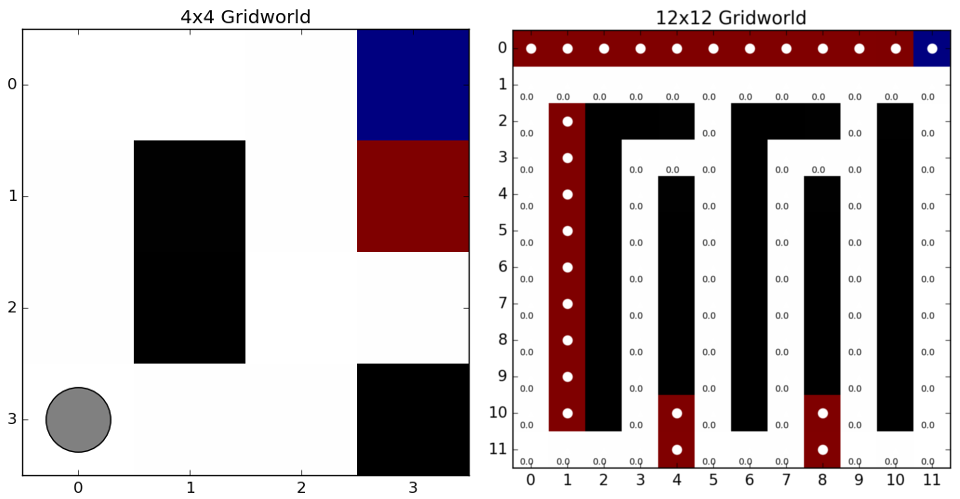
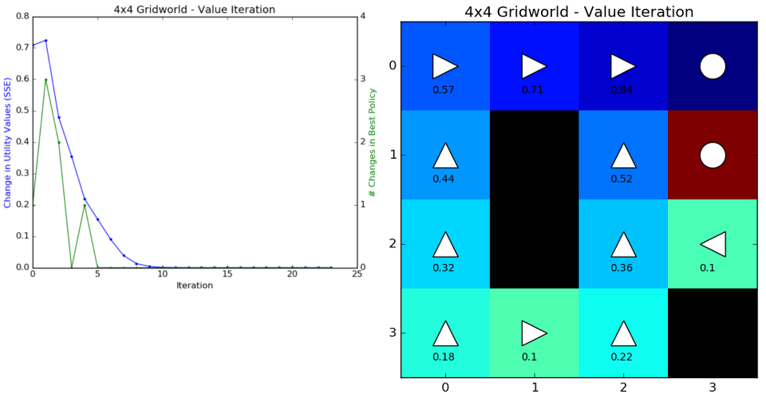
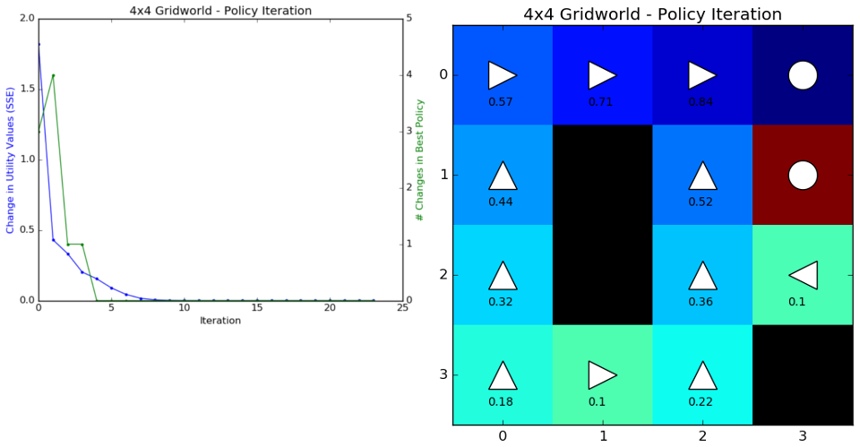
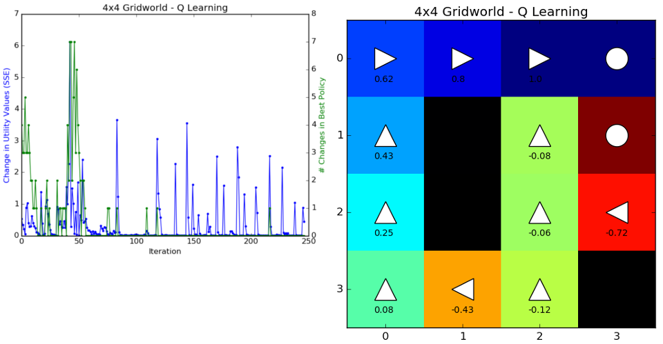
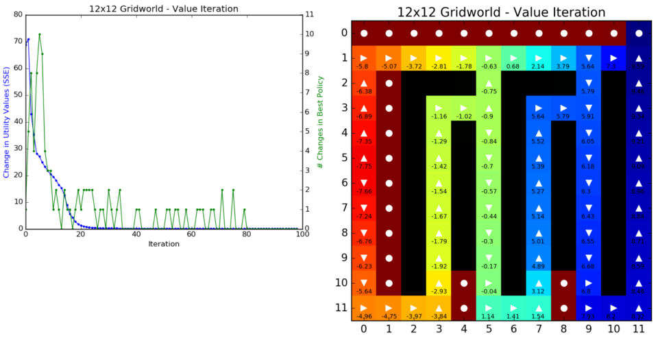
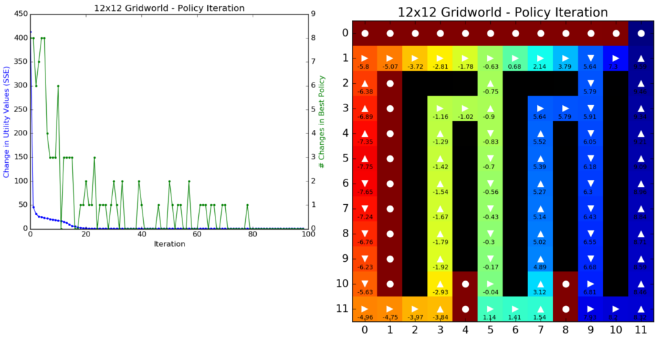
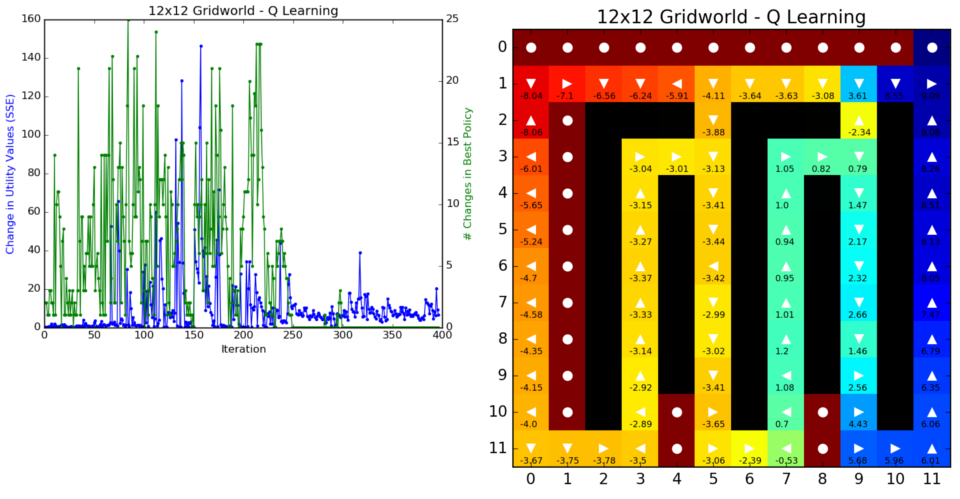

# Markov Decision Processes

# Introduction
This report explores two Markov Decision Processes (MDPs) and implements three algorithms: value iteration, policy iteration, and Q-learning. The problems and algorithms are compared in terms of convergence, iterations, runtime, and optimal rewards.

# Requirements
- Python 2.7.12
- numpy 1.13.3
- matplotlib.pyplot 1.5.3
- scipy 1.1.0
- cv2
- time

# How to Use

Run this commands within the code directory.

```python
python rl.py
```

# Algorithms

### Value Iteration: 
This algorithm implements the Bellman equation to evaluate the utility values of each state until converging to a solution. The utility of a state is determined by calculating the reward received immediately at that state, plus the discounted sum of rewards of following the optimal policy thereafter.

### Policy Iteration: 
Like value iteration, this algorithm also implements the Bellman equation. However, policy iteration uses a linear set of equations to compute the optimal policy directly. Instead of iterating over states and calculating the utility values to derive a policy, policy iteration iterates over policies and calculates the utility values until convergence.

### Q-Learning:
Unlike the other two algorithms, Q-learning is a reinforcement learning, model-free algorithm that does not use domain knowledge. This algorithm does not know the transition function probabilities and reward function. The agent must visit the states and incrementally use experience to learn the values and find the optimal policy. It also applies the Bellman equation to estimate the Q value for each state, which corresponds to the reward for entering a state, leaving via a certain action, and proceeding optimally thereafter.

# GridWorld MDP

GridWorlds are an MDP consisting of squares within a rectangular grid space. An agent (grey circle) must follow a policy that navigates through the space to reach the goal state (blue square). The agent cannot pass through obstacles (black squares), and must avoid traps (red squares). The agent receives either a positive or negative reward at each step, and can move up, down, left, or right. Furthermore, the nature of the agent’s actions is stochastic: the agent actually moves in its determined direction with only 80% probability; it will instead move at a right angle with 20% probability. The algorithms must find the optimal policy that maximizes the total reward.




## Simple GridWorld

This small MDP consists of a 4x4 grid with a goal state reward of 1, a terminal trap state reward of -1, and a negative reward of -0.1 at every other state.





## Complex GridWorld

This large MDP consists of a 12x12 grid with a goal state reward of 10, multiple terminal trap state rewards of -10, and a negative reward of -0.1 at every other state.





# References
This code is adapted from the following GitHub repository: https://github.com/kevlar1818/grid-world-rl